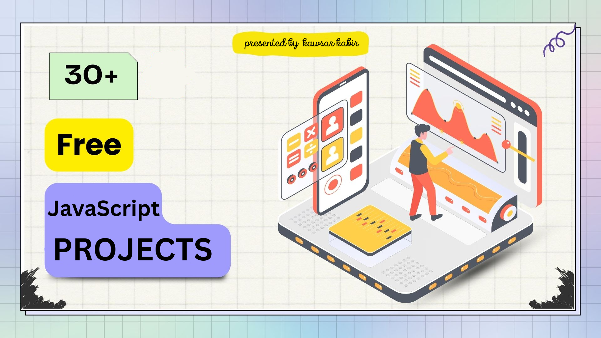

[![Youtube][youtube-shield]][youtube-url]
[![Facebook][facebook-shield]][facebook-url]
[![Instagram][instagram-shield]][instagram-url]
[![LinkedIn][linkedin-shield]][linkedin-url]

<!-- PROJECT LOGO -->
<br />
<p align="center">
    
</p>

<h3 align="center"> Vanilla JavaScript ShowCase</h3>
<p align="center">
    This repository is a collection of projects demonstrating the use of Vanilla JavaScript. Each project focuses on showcasing various features and functionalities using only plain JavaScript, without relying on any external libraries or frameworks.
</p>

<!-- Insructions -->

### Instructions

```bash
# Clone the repository
git clone https://github.com/kawsarkabir/vanila-javascript-showcase.git

# Navigate to the project folder
cd vanila-javascript-showcase

# Run a specific project (replace 'project-name' with the actual folder name)
cd project-name
npm i
npm run dev
```

### About Me

A passionate web developer with a strong skill set in JavaScript, React.js, Redux, TypeScript, NexjJS. I&lsquo;m dedicated to crafting visually stunning and highly responsive websites with a keen eye for details and a commitment to clean, efficient code, I specialize in creating web experiences that leave a lasting impression.

Feel free to connect with me on [LinkedIn](https://www.linkedin.com/in/kawsarkabir/) to discuss frontend development, design, or anything related to the exciting world of web development!

<!-- MARKDOWN LINKS & IMAGES -->

[youtube-shield]: https://img.shields.io/badge/-Youtube-black.svg?style=flat-square&logo=youtube&color=555&logoColor=white
[youtube-url]: https://youtube.com/@kawsarkabir
[facebook-shield]: https://img.shields.io/badge/-Facebook-black.svg?style=flat-square&logo=facebook&color=555&logoColor=white
[facebook-url]: https://facebook.com/devkawsarkabir
[instagram-shield]: https://img.shields.io/badge/-Instagram-black.svg?style=flat-square&logo=instagram&color=555&logoColor=white
[instagram-url]: https://instagram.com/devkawsarkabir
[linkedin-shield]: https://img.shields.io/badge/-LinkedIn-black.svg?style=flat-square&logo=linkedin&colorB=555
[linkedin-url]: https://linkedin.com/in/kawsarkabir
